# Taskly

Taskly is a monorepo task-tracker application with a Next.js frontend and an Express + TypeScript backend backed by MongoDB and Redis.

## Repository Layout

- `frontend/` - Next.js application
- `backend/` - Express API
- `RUN_AND_DEPLOY.md` - local run and deployment notes

## Tech Stack

- Frontend: Next.js 16, React 19, Tailwind CSS
- Backend: Express, TypeScript, Zod, Mongoose
- Data: MongoDB
- Cache: Redis
- Testing: Jest, Supertest, mongodb-memory-server, redis-mock

## Prerequisites

- Node.js 20+
- npm 10+
- MongoDB
- Redis

## Environment Setup

Copy the example files before starting the app:

```bash
cp backend/.env.example backend/.env
cp frontend/.env.example frontend/.env.local
```

### Backend Environment Variables

| Variable | Purpose | Example value |
| --- | --- | --- |
| `PORT` | Backend HTTP port for local workspace development | `5500` |
| `MONGODB_URI` | MongoDB connection string | `mongodb://127.0.0.1:27017/task-tracker` |
| `REDIS_URL` | Redis connection string | `redis://127.0.0.1:6379` |
| `JWT_SECRET` | Secret used to sign auth tokens | `change-this-before-production` |
| `JWT_EXPIRES_IN` | JWT lifetime | `7d` |
| `NODE_ENV` | Runtime environment | `development` |
| `FRONTEND_URL` | Allowed frontend origin for CORS | `http://localhost:3000` |

### Frontend Environment Variables

| Variable | Purpose | Example value |
| --- | --- | --- |
| `NEXT_PUBLIC_API_URL` | Backend base URL used by the Next.js API proxy | `http://localhost:5500` |

## Local Development

The provided `.env.example` files are configured for local workspace development with:

- Frontend: `http://localhost:3000`
- Backend API: `http://localhost:5500`

Install dependencies:

```bash
npm install
```

Start MongoDB and Redis locally, then run:

```bash
npm run dev
```

Or run the apps separately:

```bash
npm run dev:backend
```

```bash
npm run dev:frontend
```

## Available Scripts

At the repo root:

```bash
npm run dev
npm run start
npm run build
npm test
npm run lint
npm run verify
```

Workspace-specific commands:

```bash
npm run dev -w frontend
npm run dev -w backend
npm run test -w backend
npm run test:coverage -w backend
```

## Application Features

- Signup, login, logout, and profile retrieval
- Task create, read, update, and delete
- Task ownership isolation per authenticated user
- Due date support and pending/completed status
- Redis-backed task list caching with invalidation on task mutation
- Dashboard filtering and sorting in the frontend

## API Routes

### Auth

- `POST /api/auth/signup`
- `POST /api/auth/login`
- `POST /api/auth/logout`
- `GET /api/auth/me`

### Tasks

- `GET /api/tasks`
- `POST /api/tasks`
- `PUT /api/tasks/:id`
- `DELETE /api/tasks/:id`

## Screenshots

The screenshots below show the authentication flow, dashboard states, task CRUD interactions, filtering, and responsive mobile layout.

Task list updates after create/update/delete actions, and status changes are reflected immediately. Filters and completion states are highlighted in the screenshots below.

### Web

| Screenshot | Screenshot |
| --- | --- |
| 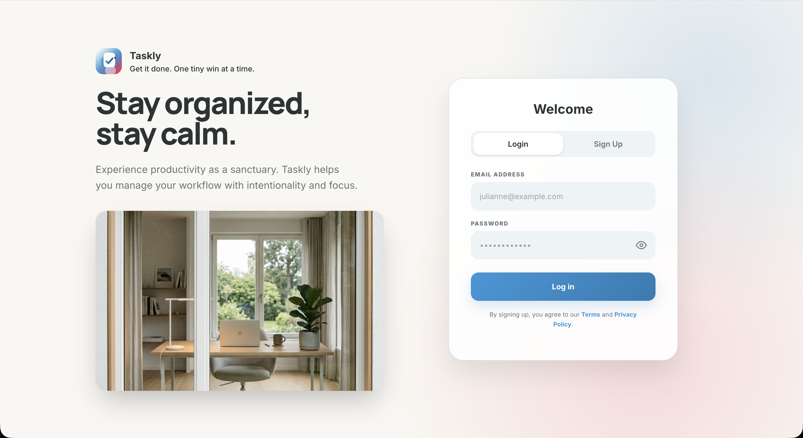<br>Login screen | 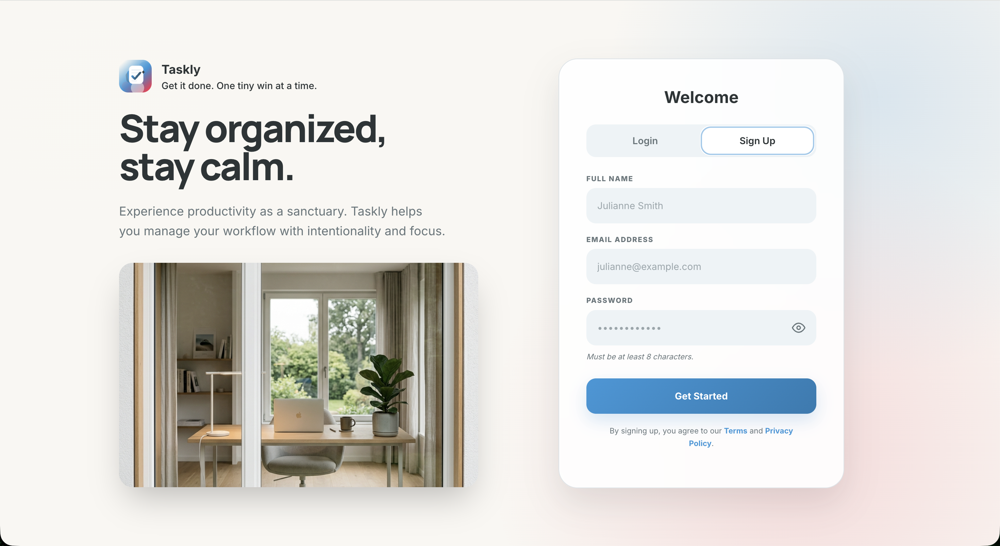<br>Signup screen |
| 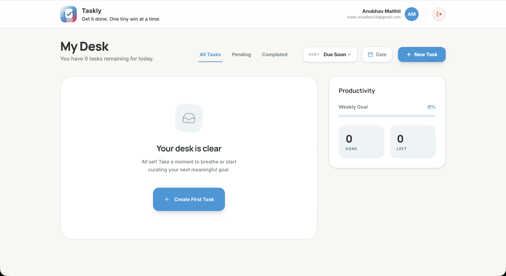<br>Dashboard overview | 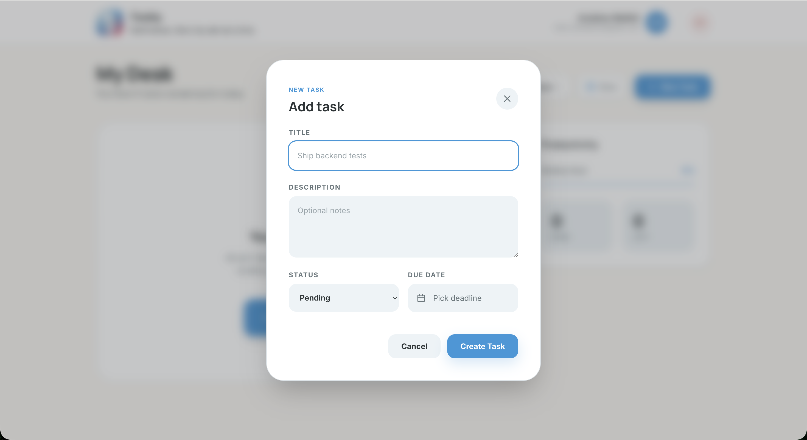<br>Create task modal |
| 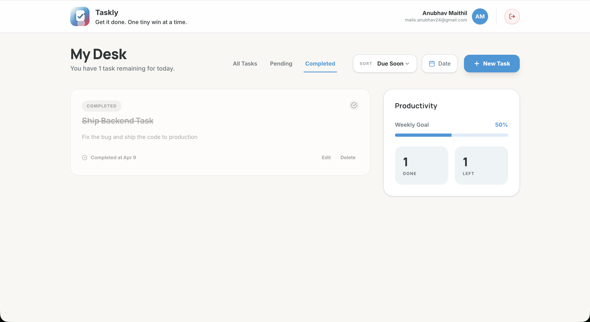<br>Task filtering (Completed) | 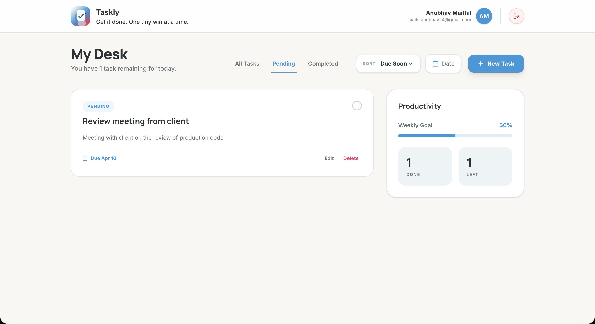<br>Pending filter state |
| 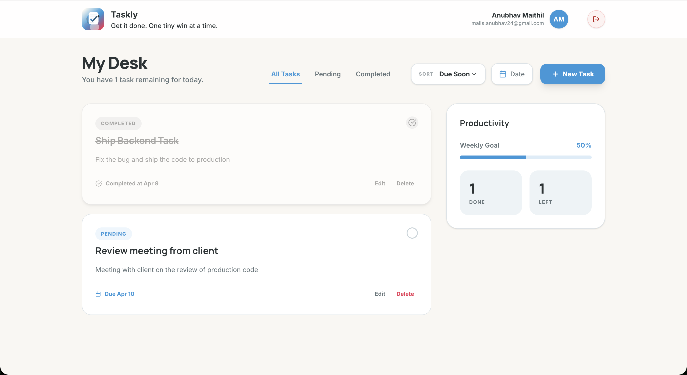<br>Completed task state | 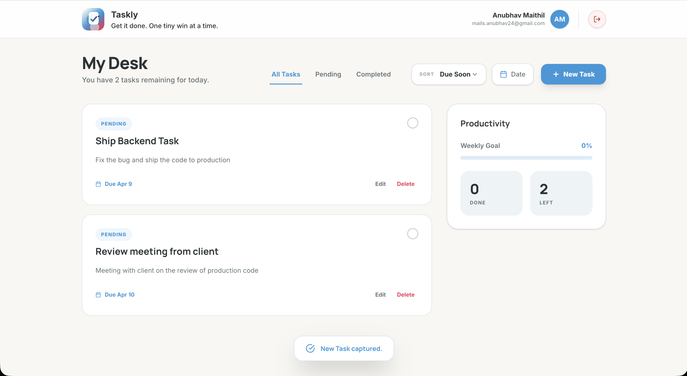<br>Dynamic feedback after actions |

### Mobile

| Screenshot | Screenshot |
| --- | --- |
| 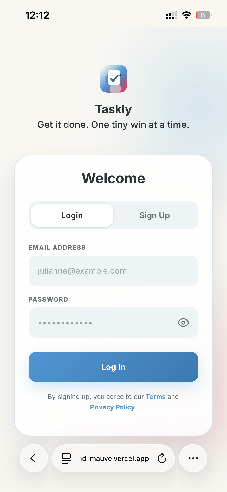<br>Mobile login flow | 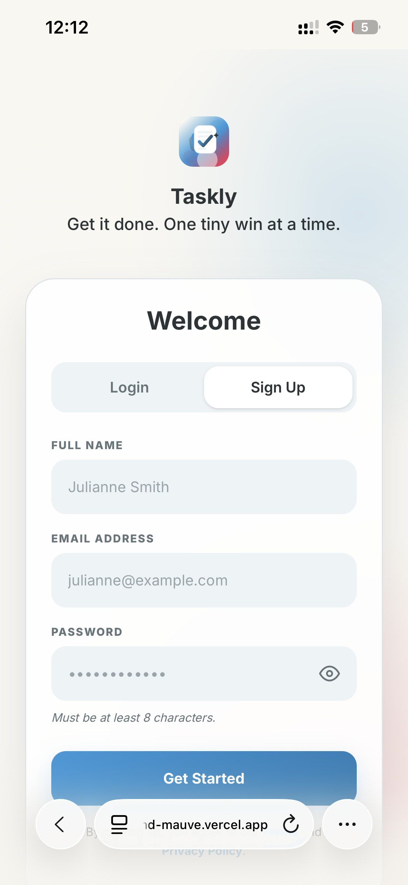<br>Mobile signup flow |
| 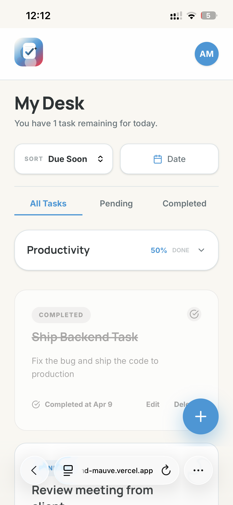<br>Responsive dashboard | 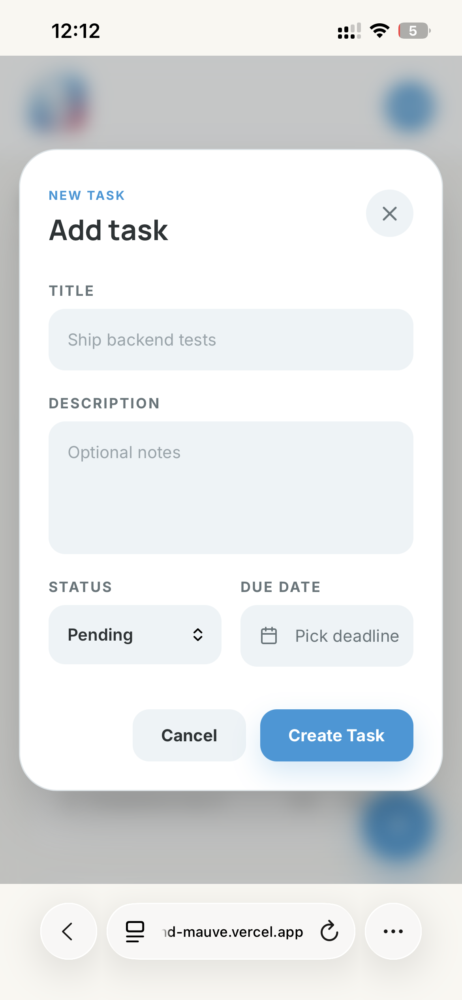<br>Task creation on mobile |
| 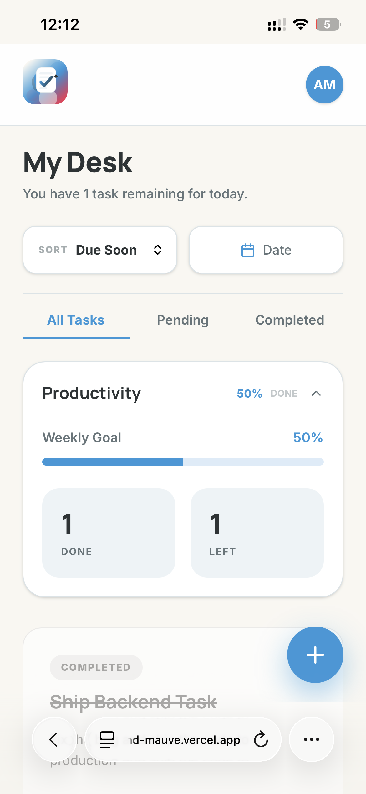<br>Productivity overview | 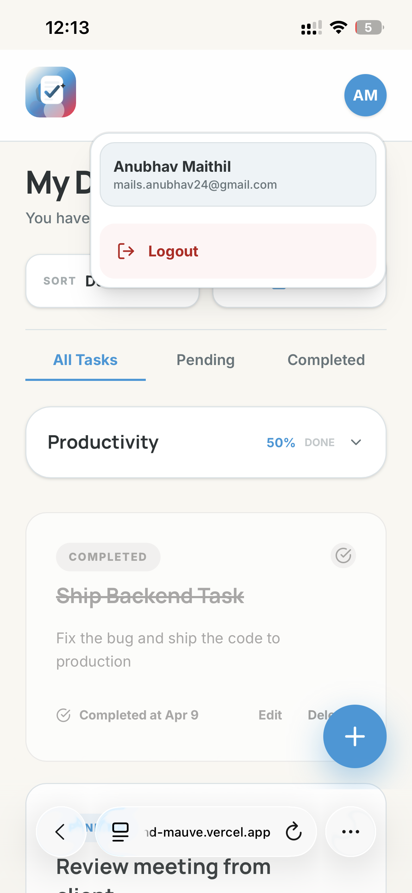<br>Secure logout |

## Deployment

This repository is intended to be deployed without Docker:

- Frontend: Vercel
- Backend: Render web service
- Redis: Render Key Value or another managed Redis provider
- MongoDB: MongoDB Atlas or another managed MongoDB provider

See [RUN_AND_DEPLOY.md](/Users/anubhavmaithil/Desktop/Projss/task-tracker/RUN_AND_DEPLOY.md) for environment-variable and platform setup details.

## Notes

- The backend code defaults to port `5500` if `PORT` is not set, and the provided `backend/.env.example` keeps that same local default.
- The frontend dev server uses the standard Next.js default port `3000`.
- The frontend API URL should always point to the backend service, not the frontend URL.
- The browser talks to same-origin Next.js `/api/*` routes, and those routes proxy requests to the backend so auth cookies can be stored on the frontend domain.
